Android Barcode Generator Demo
===================================

A demo that generates barcodes in Android

Introduction
------------

This sample demonstrates a barcode generator in Android, which supports various types of barcode such as QR Code, Barcode-128, Data Matrix, PDF-417, Barcode-39, Barcode-93 and AZTEC etc. Barcode can be saved as image into the photo gallery. 

Pre-requisites
--------------

- Android SDK 23
- ZXing Core 3.3.3

(http://repo1.maven.org/maven2/com/google/zxing/core/)

Screenshots
-------------

Home page where you can enter the message and choose the barcode type

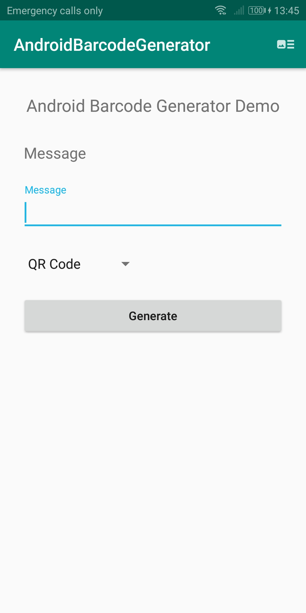 

 
 
 

Type of barcodes available. 

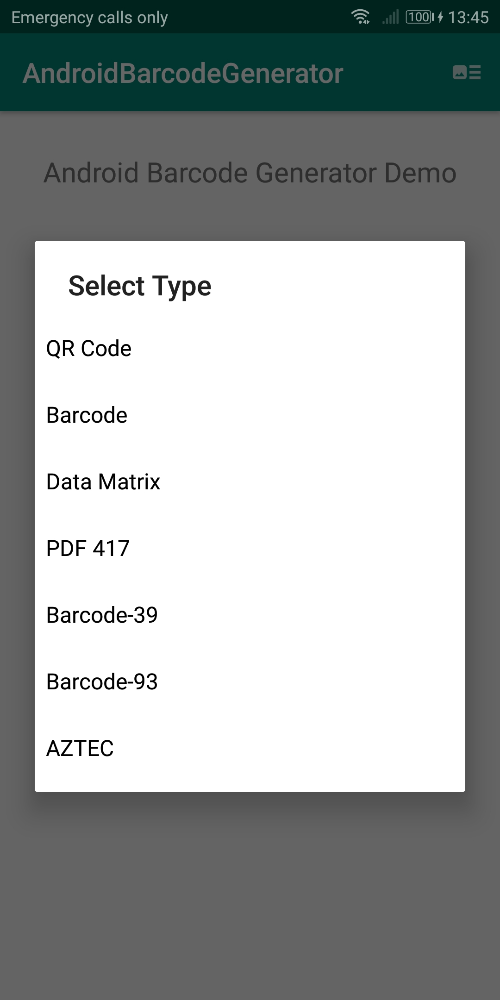 

 
 
 

Generated barcoeds, QR Code, Barcode-128, Data Matrix, PDF-417, Barcode-39, Barcode-93 and AZTEC

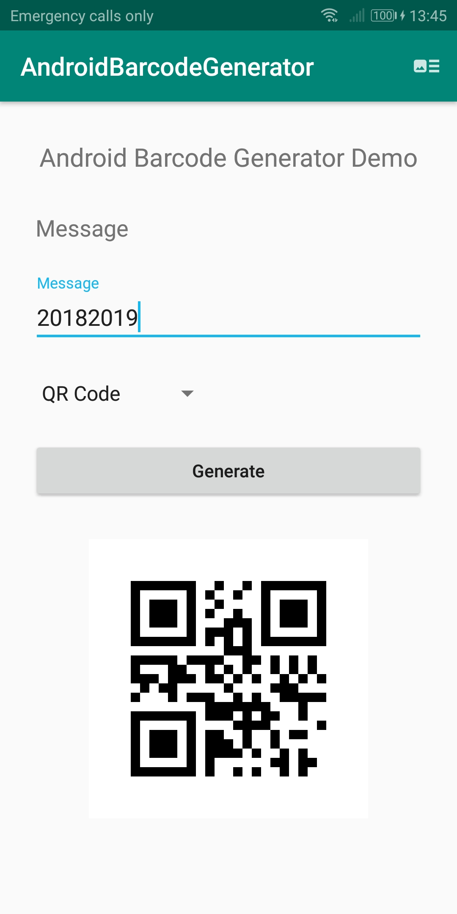 
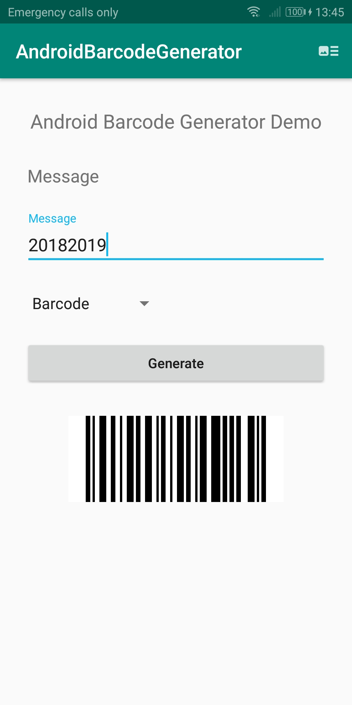 
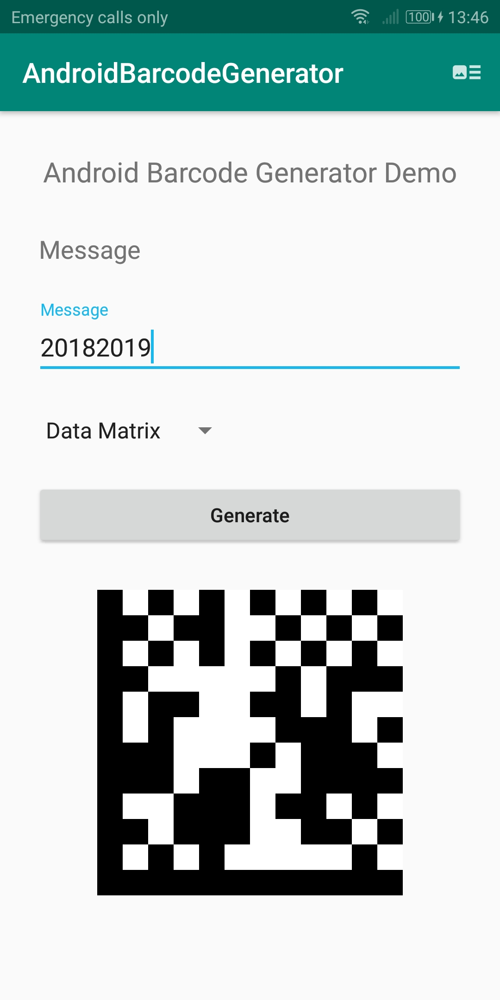 
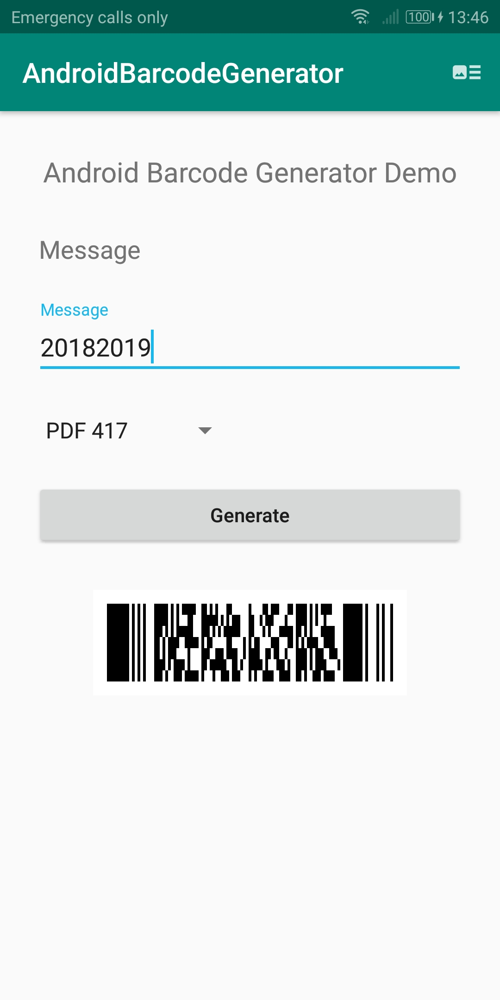 
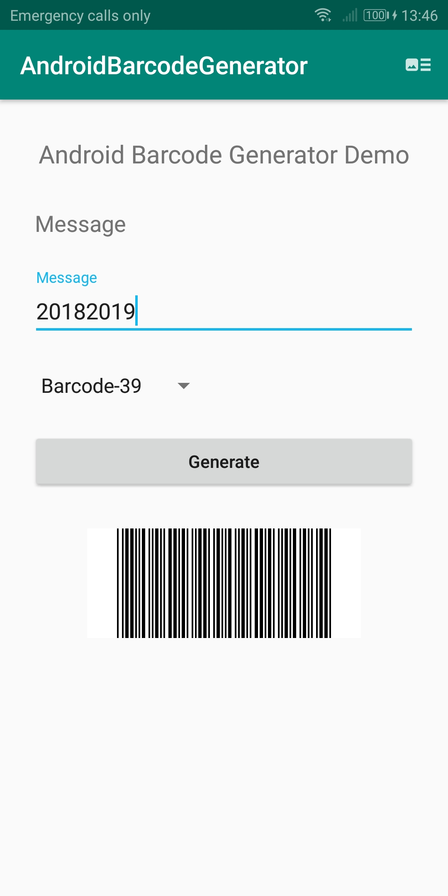 
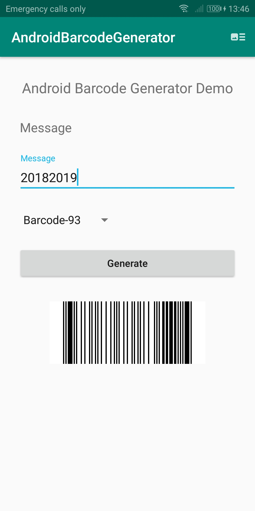 
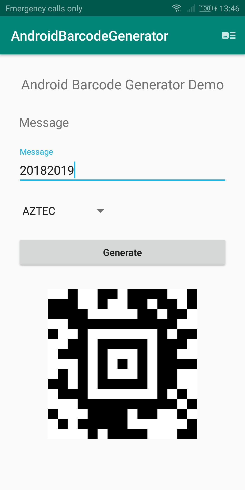 

 
 
 

Save the generated barcode into photo gallery. 

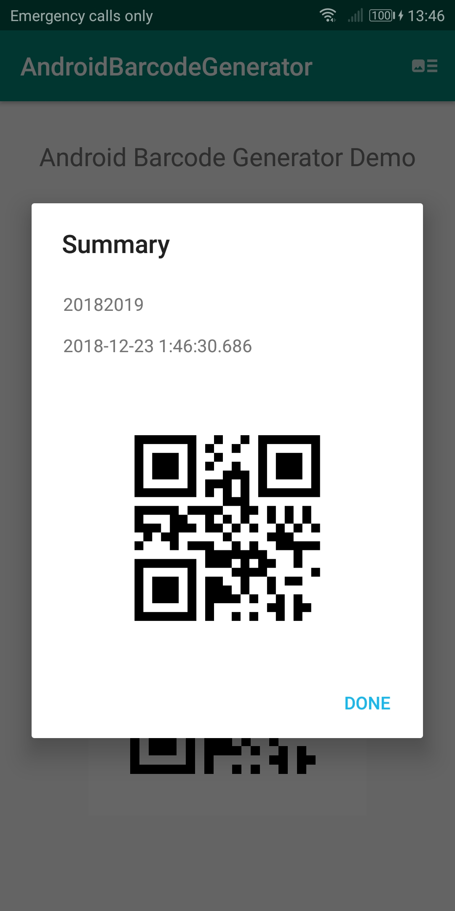 
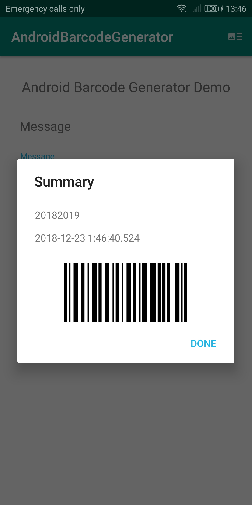 
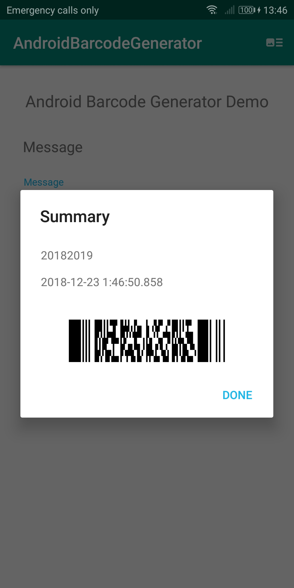 

 
 
 

Todo
---------------

- Barcode/QR Code scanner
- Scanning from web pages
- Image size control dialog

(https://github.com/zxing/zxing/wiki/Scanning-From-Web-Pages)

Licence
---------------

MIT License

